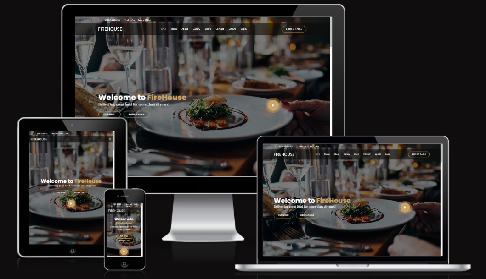

<h1 align="center">FireHouse Restaurant</h1>
<h2 align="center"></h2>

This website is made for a fictional New York restaurant called FireHouse restaurant. It is the fourth project in the Code institute Full Stack Developer program. 
The website is for restaurant customers that are looking for a nice and pleasant place to eat and hang out at while in New York that has great food and a cool interior and atmosphere. The customer can create an account so that they are able make a reservation directly on the website.
         
[View the live project here.](https://firehouse-restaurant.herokuapp.com/)

## TOC

- [User Experience (UX)](#user-experience-ux)
  - [User Stories](#user-stories)
  - [Agile Methodology](#agile-methodology)
  - [Design](#design)
    - [Wireframes](#wireframes)
    - [Database Schema](#database-schema)
- [Features](#features)
  - [Future Features](#future-features)
- [Technologies Used](#technologies-used)
  - [Languages Used](#languages-used)
  - [Frameworks Used](#frameworks-used)
- [Testing](#testing)
  - [Bugs](#bugs)
    - [Fixed Bugs](#fixed-bugs)
    - [Remaining Bugs](#remaining-bugs)
- [Deployment](#deployment)
  - [Forking the GitHub Repository](#forking-the-github-repository)
  - [Making a Local Clone](#making-a-local-clone)
  - [Deploying with Heroku](#deploying-with-heroku)
- [Credits](#credits)
  - [Code](#code)
  - [Media](#media)
  - [Acknowledgments](#acknowledgments)

## User Experience (UX)

-   ### User stories

    -   #### First Time Visitor Goals
        
    -   #### Returning Visitor Goals

    -   #### Frequent User Goals

-   ### Agile methodology

-   ### Design

-   ### Wireframes

-   ### Database Schema

## Features

### Future Features

## Technologies Used

### Languages Used

### Frameworks, Libraries & Programs Used

## Testing

### Bugs

#### Fixed Bugs

#### Remaining Bugs

### Testing User Stories from User Experience (UX) Section

-   #### First Time Visitor Goals

-   #### Returning Visitor Goals

-   #### Frequent User Goals

### Further Testing

## Deployment

### GitHub Pages

### Forking the GitHub Repository

### Making a Local Clone

## Credits

### Code

### Content

### Media

### Acknowledgements