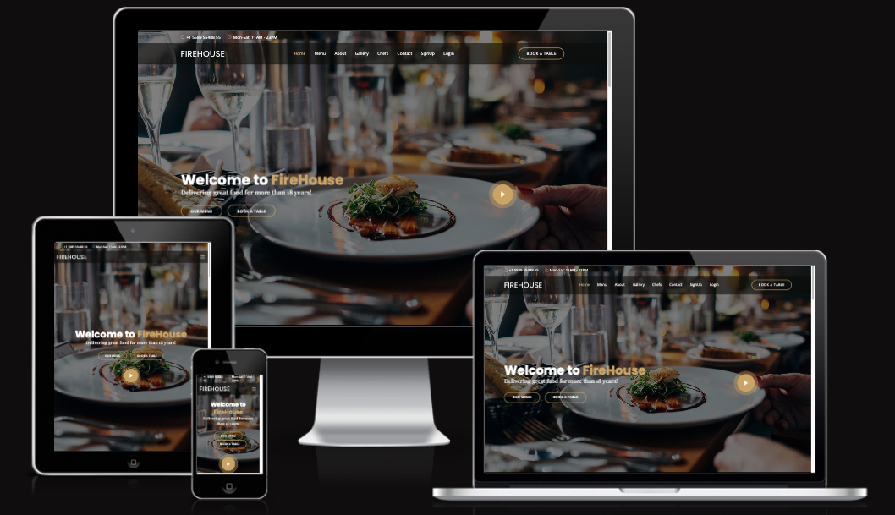

<h1 align="center">FireHouse Restaurant</h1>

This website is made for a fictional New York restaurant called FireHouse restaurant. It is the fourth project in the Code institute Full Stack Developer program. 
The website is for restaurant customers that are looking for a nice and pleasant place to eat and hang out at while in New York, that has great food and a cool interior and atmosphere. Furthermore, the website comes with an account registration and booking functionality so that customers are able to make and manage their reservations directly through the website.
         
[View the live project here.](https://firehouse-restaurant.herokuapp.com/)

## TOC
___
- [User Experience (UX)](#user-experience-ux)
  - [User Stories](#user-stories)
  - [Agile Methodology](#agile-methodology)
  - [Design](#design)
    - [Wireframes](#wireframes)
    - [Database Schema](#database-schema)
- [Features](#features)
  - [Future Features](#future-features)
- [Technologies Used](#technologies-used)
  - [Languages](#languages)
  - [Frameworks Libraries Programs](#frameworks-libraries-programs)
- [Testing](#testing)
  - [Bugs](#bugs)
    - [Fixed Bugs](#fixed-bugs)
    - [Remaining Bugs](#remaining-bugs)
- [Deployment](#deployment)
  - [Forking the GitHub Repository](#forking-the-github-repository)
  - [Running the project locally](#running-the-project-locally)
  - [Deploying with Heroku](#deploying-with-heroku)
- [Credits](#credits)
  - [Code](#code)
  - [Media](#media)
  - [Acknowledgements](#acknowledgements)

## User Experience (UX)
___

-   ### User stories

    -   #### First Time Visitor Goals
          - As a first time visitor I can read and learn about the location and history and get a feel for the restaurant.
          - As a first time visitor I can find out what kind of food they serve from their menu.
          - As a first time visitor I can find information about how to make a reservation at the restaurant.
        
    -   #### Returning Visitor Goals
        -  As a returning visitor I can create an account so I can make a reservation online.
        -  As a returning visitor I can view the menu to see if has changed.
        -  As a returning visitor I can signup for the newsletter so that I can receive updates and news.

    -   #### Frequent User Goals
        -  As a frequent visitor I can login and find my current bookings.
        -  As a frequent visitor I can view my bookings in the login page.
        -  As a frequent visitor I can change or cancel my booking in the login page.

-   ### Agile methodology

-   ### Design

-   ### Wireframes

-   ### Database Schema

## Features  
___

  

### Navbar  
- Info  
  

### Hero  
- Info  
  

### About
- Info  
  

### Testimonials  
- Info  
  

### Gallery  
- Info  
  

### Contact  
- Info   
  

### Footer  
- Info   
  

### Account signup/login  
- Info   

  

### Future Features

## Technologies Used
___
### Languages
   - Python
   - JavaScript
   - HTML5
   - CSS3
   

### Frameworks, Libraries, Programs
- Python Built-in Modules:
  - [os](https://docs.python.org/3/library/os.html) 

- External Packages
  - [cloudinary](https://pypi.org/project/cloudinary/1.29.0/) 
  - [crispy-bootstrap5](https://pypi.org/project/crispy-bootstrap5/0.6/) 
  - [dj-database-url](https://pypi.org/project/dj-database-url/0.5.0/) 
  - [dj3-cloudinary-storage](https://pypi.org/project/dj3-cloudinary-storage/0.0.6/) 
  - [Django](https://pypi.org/project/Django/3.2.14/) 
  - [django-allauth](https://pypi.org/project/django-allauth/0.51.0/)
  - [django-crispy-forms](https://pypi.org/project/django-crispy-forms/1.14.0/) 
  - [gunicorn](https://pypi.org/project/gunicorn/20.1.0/)
  - [psycopg2](https://pypi.org/project/psycopg2/2.9.3/) 

### Programs & Tools

- [Google Fonts:](https://fonts.google.com/)
  - Was used to to incorporate font styles.  
- [Bootstrap](https://getbootstrap.com/)
  - Was used to create the front-end design.
- [GitPod:](https://gitpod.io/)
  - Gitpod was used as IDE to commit and push the project to GitHub.
- [GitHub:](https://github.com/)
  - Was used for all storing and backup of the code pertaining to the project.
- [Balsamiq:](https://balsamiq.com/)
  - Was used to create wireframes
 

## Testing
___
A separate document for testing can be viewed here: [TESTING.md](docs/TESTING.md)

### Bugs

#### Fixed Bugs

|Bug | Solution | Status |
|----|:---------|:-------|
|Integrity error| Update the booking_page function | Fixed |

#### Remaining Bugs
  - No known bugs remaining

### Testing User Stories from User Experience (UX) Section

-   #### First Time Visitor Goals

-   #### Returning Visitor Goals

-   #### Frequent User Goals

### Further Testing

## Deployment
___

### Forking the GitHub Repository
1. Go to [the project repository](https://github.com/ErikHgm/FireHouse-Restaurant-Project)
2. In the right most top menu, click the "Fork" button.
3. There will now be a copy of the repository in your own GitHub account.

### Running the project locally
1. Go to [the project repository](https://github.com/ErikHgm/FireHouse-Restaurant-Project)
2. Click on the "Code" button.
3. Choose one of the three options (HTTPS, SSH or GitHub CLI) and then click copy.
4. Open the terminal in you IDE program. 
5. Type `git clone` and paste the URL that was copied in step 3.
6. Press Enter and the local clone will be created. 

### Alternatively by using Gitpod:
1. Go to [the project repository](https://github.com/ErikHgm/FireHouse-Restaurant-Project)
2. Click the green button that says "Gitpod" and the project will now open up in Gitpod.

### Deploying with Heroku

I followed the below steps using the Code Institute tutorial:

The following command in the Gitpod CLI will create the relevant files needed for Heroku to install your project dependencies `pip3 freeze --local > requirements.txt`. Please note this file should be added to a .gitignore file to prevent the file from being committed.

1. Go to [Heroku.com](https://dashboard.heroku.com/apps) and log in; if you do not already have an account then you will need to create one.
2. Click the `New` dropdown and select `Create New App`.
3. Enter a name for your new project, all Heroku apps need to have a unique name, you will be prompted if you need to change it.
4. Select the region you are working in.

#### Heroku Settings  
You will need to set your Environment Variables - this is a key step to ensuring your application is deployed properly.
1. In the Settings tab, click on `Reveal Config Vars` and set the following variables:
    - Add key: `PORT` & value `8000`
    - Add key: DATABASE_URL, this should have been created automatically by Heroku.
    - Add key: CLOUDINARY_URL and the value as your cloudinary API Environment variable e.g.
    - Add key: SECRET_KEY and the value as a complex string which will be used to provide cryptographic signing.

2. Buildpacks are also required for proper deployment, simply click `Add buildpack` and search for the ones that you require.
    - For this project, I needed to add `Python`.

####  Heroku Deployment  
In the Deploy tab:
1. Connect your Heroku account to your Github Repository following these steps:
    - Click on the `Deploy` tab and choose `Github-Connect to Github`.
    - Enter the GitHub repository name and click on `Search`.
    - Choose the correct repository for your application and click on `Connect`.
2. You can then choose to deploy the project manually or automatically, automatic deployment will generate a new application every time you push a change to Github, whereas manual deployment requires you to push the `Deploy Branch` button whenever you want a change made.
3. Once you have chosen your deployment method and have clicked `Deploy Branch` your application will be built and you should now see the `View` button, click this to open your application.

## Credits
___
### Code
  - [Restaurantly Boostrap theme](https://bootstrapmade.com/restaurantly-restaurant-template/) was the Boostrap theme used in the project.
  - [Django Documenation](https://www.djangoproject.com/) was used to provide examples of code solutions and Django functionality.
  - [Bootstrap Documenation](https://getbootstrap.com/) was used to provide examples of Bootstrap functionality and building blocks.
  - [Code Institute walkthrough](https://codeinstitute.net/) as inspiration and code examples, the code institute walkthroughs "Hello Django" and "I Think Therefore I Blog" was used.

### Content
  - The texts that are used for testimonials comes from [Tripadvisor](https://www.tripadvisor.com/).
  - The texts that are used for the about section comes from [Royal35](https://royal35steakhouse.com/) website.

### Media
  - The images in the project comes from the [Restaurantly Boostrap theme](https://bootstrapmade.com/restaurantly-restaurant-template/)
  - The video in the project comes from the [Restaurantly Boostrap theme](https://bootstrapmade.com/restaurantly-restaurant-template/)

### Acknowledgements
  - The tutor support team at Code Institute for their support.
  - My Code Institute Mentor for feedback and suggestions.
  - The Code Institute Slack community.

  [Back to top](#toc)