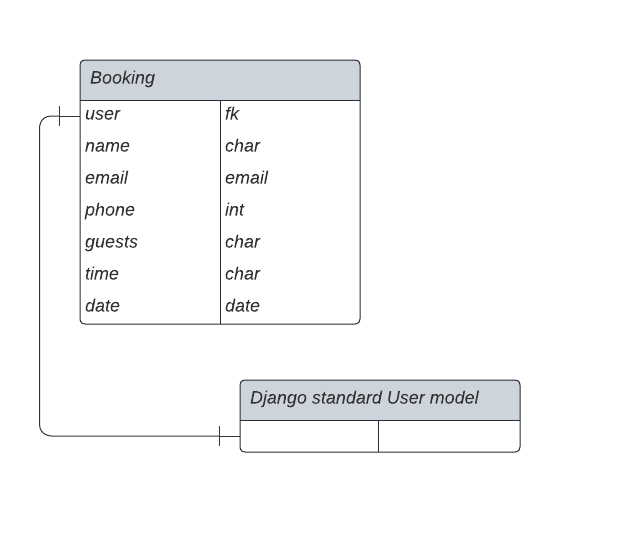

<h1 align="center">FireHouse Restaurant</h1>

This website is made for a fictional New York restaurant called FireHouse restaurant. It is the fourth project in the Code institute Full Stack Developer program. 
The website is for restaurant customers that are looking for a nice and pleasant place to eat and hang out at while in New York, that has great food and a cool interior and atmosphere. Furthermore, the website comes with an account registration and booking functionality so that customers are able to make and manage their reservations directly through the website.
         
[View the live project here.](https://firehouse-restaurant.herokuapp.com/)

## TOC

- [User Experience (UX)](#user-experience-ux)
  - [Project goals](#project-goals)
  - [User Stories](#user-stories)
  - [Agile Methodology](#agile-methodology)
  - [Design](#design)
    - [Wireframes](#wireframes)
    - [Database Schema](#database-schema)
- [Features](#features)
  - [Future Features](#future-features)
- [Technologies Used](#technologies-used)
  - [Languages](#languages)
  - [Frameworks Libraries Programs](#frameworks-libraries-programs)
- [Testing](#testing)
  - [Bugs](#bugs)
    - [Fixed Bugs](#fixed-bugs)
    - [Remaining Bugs](#remaining-bugs)
- [Deployment](#deployment)
  - [Forking the GitHub Repository](#forking-the-github-repository)
  - [Running the project locally](#running-the-project-locally)
  - [Deploying with Heroku](#deploying-with-heroku)
- [Credits](#credits)
  - [Code](#code)
  - [Media](#media)
  - [Acknowledgements](#acknowledgements)

## User Experience (UX)
-   ### Project goals  
  The overall goal of the website is to create a restaurant webpage that is enticing for the visitors that generates an interest and curiosity to visit the restaurant. Visitors should be able to find general information about the restaurant as well as finding the menu offerings. In addition, visitors should be able to make a reservation for a table directly on the webpage. It will also provide a booking management admin panel for the staff members.  
  
-   ### User stories

    -   #### First Time Visitor Goals
          - As a first time visitor I can read and learn about the location and history and get a feel for the restaurant.
          - As a first time visitor I can find out what kind of food they serve from their menu.
          - As a first time visitor I can find information about how to make a reservation at the restaurant.
        
    -   #### Returning Visitor Goals
        -  As a returning visitor I can create an account so I can make a reservation online.
        -  As a returning visitor I can view the menu to see if has changed.

    -   #### Frequent User Goals
        -  As a frequent visitor I can login and find my current bookings.
        -  As a frequent visitor I can change or cancel my booking in the login page.

-   ### Agile methodology
    - The principles of agile methodology were utilized during the project. By assigning user stories to issues and taking advantage of the GitHub Kanban board functionality, the necessary goals and priorities throughout the project could be well defined. In addition, labels were used to further define the priority of eacn user story in the Kanban board.  

-   ### Design
    - The theme for the project were chosen in accordance with the intended target market in mind for the restaurant. With its fancy looks and feel, dark colors and luxurious details and effects, the theme fits perfect for the goal of giving the visitor the impression that this is a very high quality restaurant. 
    
     - Colors  
        - The main colors are overall black to provide an elegant look and feel. Furthermore, elements such as buttons, icons, symbols, links and headings are made in gold color that follows the pattern of elegance and adds to the premier look and feel of the webpage.  
     - Font  
        - The fonts in the theme are clear and modern and contribute perfectly to the overall elegant setting.  
     - Images  
        - The images in the theme provide great content and presentation of the restaurant and serves as an enticement for the visitors.  

-   ### Wireframes  
    - A separate document for the wireframes can be viewed here: 
      - [For Desktop view](docs/WIREFRAMES.md)
      - [For Mobile view](docs/WIREFRAMES_mobile.md)    

-   ### Database Schema  
    - The database design schema can be viewed below. It consists of a Booking model with a foreignKey of User that relates to the Django standard User model class.  
      

## Features  

### Navbar  
- The navbar shows all the sections that the user can enter and provides a quick and easy means of navigating the site. The link to make a booking is enlarged to make it extra easy to find and use. 
&nbsp;  

  

### Hero  
- The hero section makes for a great first impression of the site and thus the restaurant for the visitor. It also encompasses the links that the user most likely needs the most often which is the menu link and the link to make a reservation at the restaurant. It also includes a link to a presentation video about the restaurant to further market the restaurant to the visitor.
&nbsp;  

  

### Menu
- The menu section comes with images and descriptions of all the different options available at the restaurant. It also has a functionality to filter options based on type of meal. 
&nbsp;  

  

### About
- The about section incorporates some of the design and settings of the restaurant to further enhance its unique selling points.  
&nbsp;  

  

### Testimonials  
- The testimonials show what some of the previous customers says of the restaurant and is a method of providing social proof to increase customer conversion of the webpage.  
&nbsp;  

  

### Gallery  
- In the gallery visitors can see examples of its interior and what the restaurant looks like.  
&nbsp;  

  

### Contact  
- The contact section includes all the necessary information about the restaurant that the visitor may need to know about.  
&nbsp;  

  

### Account signup/login  
- The account pages where the user can create an account in order to make a registration as well as login as an existing users.  
&nbsp;  

  

### Booking page  
- In the booking page the customer can make a reservation using the form and save it. It will then show up in the customer's mybooking page.  
&nbsp;  

 

### Mybookings  
- The current bookings for a customer are shown on the mybooking page, that way the customer can get an overview of all bookings and check the date and time etc for each booking. On this page the customer can also click on the "change" button and make necessary updates to the booking that will be saved and shown on the mybooking page. The customer can also delete a booking by clicking on the "delete" button. It will then disappear from the list of reservations.
&nbsp;  

 

### Delete booking  
- When clicking on the "delete" button in the mybookings page, a warning message is shown to prevent Customers from deleting their bookings by mistake. 

 

### Footer  
- The footer contains the essential information about the restaurant for easy access to the most relevant contact information and social media links on all pages throughout the website.  
&nbsp;  

  

### Future Features
  - Add functionality to check that the restaurant does not get overbooked, so that if the restaurant is full it is not possible to make a reservation.
  - Add a contact form on the main page so visitors can contact the restaurant via email directly on the webpage.
  - Create functionality in the admin panel for the staff to be able to add and delete the amount of tables and seats in the restaurant and incorporate it into the booking function so that it can calculate available seats in the restaurant.
  - Create functionality in the admin panel so that restaurant personnel can update the menu items on the webpage inside the admin panel. 

## Technologies Used

### Languages
   - Python
   - JavaScript
   - HTML5
   - CSS3

### Frameworks, Libraries, Programs
- Python Built-in Modules:
  - [os](https://docs.python.org/3/library/os.html) 

- External Packages
  - [cloudinary](https://pypi.org/project/cloudinary/1.29.0/) 
  - [dj-database-url](https://pypi.org/project/dj-database-url/0.5.0/) 
  - [dj3-cloudinary-storage](https://pypi.org/project/dj3-cloudinary-storage/0.0.6/) 
  - [Django](https://pypi.org/project/Django/3.2.14/) 
  - [django-allauth](https://pypi.org/project/django-allauth/0.51.0/)
  - [gunicorn](https://pypi.org/project/gunicorn/20.1.0/)
  - [psycopg2](https://pypi.org/project/psycopg2/2.9.3/) 

### Programs & Tools

- [Google Fonts:](https://fonts.google.com/)
  - Was used to to incorporate font styles.  
- [Bootstrap](https://getbootstrap.com/)
  - Was used to create the front-end design.
- [GitPod:](https://gitpod.io/)
  - Gitpod was used as IDE to commit and push the project to GitHub.
- [GitHub:](https://github.com/)
  - Was used for all storing and backup of the code pertaining to the project.
- [Balsamiq:](https://balsamiq.com/)
  - Was used to create wireframes
- [LucidCharts:](https://www.lucidchart.com/)
  - Was used to create the database schema.
 

## Testing  
A separate document for testing can be viewed here: [TESTING.md](docs/TESTING.md)

### Bugs

#### Fixed Bugs

|Bug | Solution | Status |
|----|:---------|:-------|
|Integrity error| Update the booking_page function to add current User to form data | Fixed |
|CSS background img not showing on Heroku| Update the url to the absolute link in cloudinary | Fixed |
|A user can delete another user's bookings| Add authorization check to the delete_booking function | Fixed |
|A user can update another user's bookings| Add authorization check to the edit_booking function | Fixed |
|A user can show another user's bookings| Add authorization check to the mybookings_page function | Fixed |
|All Navbar links not working | Add 'home' ID tags to the links | Fixed |

#### Remaining Bugs
  - No known bugs remaining

### Testing User Stories from User Experience (UX) Section

  -   #### First Time Visitor Goals
      - As a first time visitor I can read and learn about the location and history and get a feel for the restaurant.
        - When entering the webpage information about the restaurant is easily found by either scrolling or navigating using the links.
      - As a first time visitor I can find out what kind of food they serve from their menu.  
        - The Customer can directly find a large link to the menu when entering the webpage.
      - As a first time visitor I can find information about how to make a reservation at the restaurant.  
        - When entering the webpage the Customer can find the booking link immediately in the hero section or in the navbar.
        
  -   #### Returning Visitor Goals
      -  As a returning visitor I can create an account so I can make a reservation online.
          -  The Customer can use the signup link and quickly create an account login.
      -  As a returning visitor I can view the menu to see if has changed.  
          - When entering the webpage the Customer will find the menu first hand by clicking on the large button or scrolling.
    
  -   #### Frequent User Goals
      -  As a frequent visitor I can login and find my current bookings.  
          - As a frequent Customer can easily login upon entering the webpage. After being logged in, the Customer can view their current bookings in the navbar.
      -  As a frequent visitor I can change or cancel my booking in the login page.  
          - After being logged in, the Customer can delete their current bookings by going to the mybookings page in the navbar.

## Deployment

### Forking the GitHub Repository
1. Go to [the project repository](https://github.com/ErikHgm/FireHouse-Restaurant-Project)
2. In the right most top menu, click the "Fork" button.
3. There will now be a copy of the repository in your own GitHub account.

### Running the project locally
1. Go to [the project repository](https://github.com/ErikHgm/FireHouse-Restaurant-Project)
2. Click on the "Code" button.
3. Choose one of the three options (HTTPS, SSH or GitHub CLI) and then click copy.
4. Open the terminal in you IDE program. 
5. Type `git clone` and paste the URL that was copied in step 3.
6. Press Enter and the local clone will be created. 

### Alternatively by using Gitpod:
1. Go to [the project repository](https://github.com/ErikHgm/FireHouse-Restaurant-Project)
2. Click the green button that says "Gitpod" and the project will now open up in Gitpod.

### Deploying with Heroku

I followed the below steps using the Code Institute tutorial:

The following command in the Gitpod CLI will create the relevant files needed for Heroku to install your project dependencies `pip3 freeze --local > requirements.txt`. Please note this file should be added to a .gitignore file to prevent the file from being committed.

1. Go to [Heroku.com](https://dashboard.heroku.com/apps) and log in; if you do not already have an account then you will need to create one.
2. Click the `New` dropdown and select `Create New App`.
3. Enter a name for your new project, all Heroku apps need to have a unique name, you will be prompted if you need to change it.
4. Select the region you are working in.

#### Heroku Settings  
You will need to set your Environment Variables - this is a key step to ensuring your application is deployed properly.
1. In the Settings tab, click on `Reveal Config Vars` and set the following variables:
    - Add key: `PORT` & value `8000`
    - Add key: DATABASE_URL, this should have been created automatically by Heroku.
    - Add key: CLOUDINARY_URL and the value as your cloudinary API Environment variable e.g.
    - Add key: SECRET_KEY and the value as a complex string which will be used to provide cryptographic signing.

2. Buildpacks are also required for proper deployment, simply click `Add buildpack` and search for the ones that you require.
    - For this project, I needed to add `Python`.

####  Heroku Deployment  
In the Deploy tab:
1. Connect your Heroku account to your Github Repository following these steps:
    - Click on the `Deploy` tab and choose `Github-Connect to Github`.
    - Enter the GitHub repository name and click on `Search`.
    - Choose the correct repository for your application and click on `Connect`.
2. You can then choose to deploy the project manually or automatically, automatic deployment will generate a new application every time you push a change to Github, whereas manual deployment requires you to push the `Deploy Branch` button whenever you want a change made.
3. Once you have chosen your deployment method and have clicked `Deploy Branch` your application will be built and you should now see the `View` button, click this to open your application.

## Credits

### Code
  - [Restaurantly Boostrap theme](https://bootstrapmade.com/restaurantly-restaurant-template/) was the Boostrap theme used in the project.
  - [Django Documenation](https://www.djangoproject.com/) was used to provide examples of code solutions and Django functionality.
  - [Bootstrap Documenation](https://getbootstrap.com/) was used to provide examples of Bootstrap functionality and building blocks.
  - [Code Institute walkthrough](https://codeinstitute.net/) as inspiration and code examples, the code institute walkthroughs "Hello Django" and "I Think Therefore I Blog" was used.

### Content
  - The texts that are used for testimonials comes from [Tripadvisor](https://www.tripadvisor.com/).
  - The texts that are used for the about section comes from [Royal35](https://royal35steakhouse.com/) website.

### Media
  - The images in the project comes from the [Restaurantly Boostrap theme](https://bootstrapmade.com/restaurantly-restaurant-template/)
  - The video in the project comes from the [Restaurantly Boostrap theme](https://bootstrapmade.com/restaurantly-restaurant-template/)

### Acknowledgements
  - The tutor support team at Code Institute for their support.
  - My Code Institute Mentor for feedback and suggestions.
  - The Code Institute Slack community.

  [Back to top](#toc)